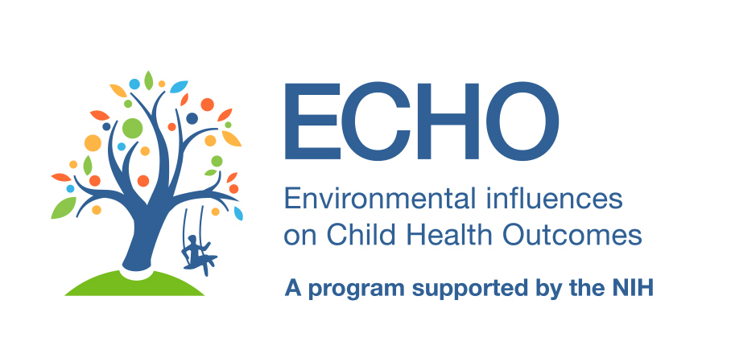

<!-- README.md is generated from README.Rmd. Please edit that file -->

# relate: REcursive muLtivariAte TEsting for cohort clustering

<!-- badges: start -->

[](https://www.repostatus.org/#wip)
[](https://github.com/yqzhong7/relate/actions)
<!-- badges: end -->

**Authors:** [Yongqi Zhong](https://github.com/yqzhong7), Ekaterina
Smirnova, Rasha Alsaadawi, Bryan Lau

**Contributors:** Amii Kress, Xuejuan Ning, Jordan Kuiper, Mingyu Zhang,
Lisa Jacobson

------------------------------------------------------------------------

The goal of *relate* is to identify cohort cluster with disparate
covariate information. This package uses unsupervised random forests to
obtain distances between observations within and across cohorts,
hierarchical clustering to identify sub-groups of cohorts, and then test
whether covariate distributions provide evidence differences in
multivariate joint distributions.

This work is supported by Environmental influences on Child Health
Outcomes [(ECHO)](https://echochildren.org/) Data Analysis Center
[(DAC)](https://www.jhsph.edu/departments/epidemiology/echo/)
\[U24OD023382; PI: Jacobson/Parker\].



------------------------------------------------------------------------

## Installation

You can install the prototype version of *relate* from
[GitHub](https://github.com/yqzhong7) with:

``` r
install.packages("remotes")
remotes::install_github("yqzhong7/relate")
```

## Tutorial

Please find the tutorial in this
[vignette](https://yqzhong7.github.io/relate/articles/relate.html)
